# 近乎完美的安卓 Model 层架构

###### Piasy  许建林 @ YOLO

<!--
感谢百万
第一次分享，不足之处望海涵
-->

---

# 自我介绍

+ Piasy，许建林 @ YOLO
+ 目前专注安卓开发
+ 必备开源库源码导读
+ Advanced RxJava 系列翻译
+ APP 架构/TDD 的思考与实践
+ https://github.com/Piasy
+ blog：http://blog.piasy.com/
+ 公众号：Piasy
+ 微博：@Piasy

---

# 注意事项

+ 需要一定的安卓开发基础
+ 分享本套架构对比传统/其他方案的优势
+ 需要 _**结合**_ 很多库，重在优势与结合，不在介绍
+ 代码都很 _**碎片**_，重点在对比出优势
+ 需要自行 Google，体验细节

<!--
用过这些库的，应该有共鸣，没用过的，一页 ppt 也讲不清楚，还需要自行学习
-->

---

# 目录

+ 初心
+ 架构
+ 不足

---

# 初心

+ 简单可依赖
+ Immutable value type
+ 发出 RESTful API 请求
+ JSON 数据格式
+ SQLite 数据库
+ Reactive

<!--
+ Immutable 让数据使用、多线程共享数据更简单
  + 不用担心在其他地方被修改，无需 defensive copy
  + 不用担心被其他线程修改，多线程共享数据更简单
+ RESTful 让CS通信更简单
+ JSON 比 xml 更简单
+ SQLite 让复杂数据持久化更简单
+ Reactive 让异步和事件流的处理更简单
-->

---

<!--
问题是什么？怎么解决？为什么解决得更好？
始终围绕一个实际问题/需求，对比本套架构与其他方案的优势
-->

# 需求：维护用户 following 列表

+ HTTP 缓存
+ 从服务器获取
+ SQLite 数据库本地缓存
+ 定义 Model 类型
+ 先展示本地缓存，再更新为网络数据
+ 多页面同步更新
+ Activity/Fragment 传参
+ 单元测试，集成测试

---

# 需求：维护用户 following 列表

+ _**HTTP 缓存**_
+ 从服务器获取
+ SQLite 数据库本地缓存
+ 定义 Model 类型
+ 先展示本地缓存，再更新为网络数据
+ 多页面同步更新
+ Activity/Fragment 传参
+ 单元测试，集成测试

---

# HTTP 缓存

+ 实现存储的读写，磁盘缓存，缓存淘汰策略？
+ 解析响应 header？
+ 实现 HTTP 缓存逻辑？
+ Socket？HttpURLConnection？
+ OkHttp！
+ http://blog.piasy.com/2016/07/11/Understand-OkHttp/

<!--
不要重复造轮子，何况造得没人家好
-->

---

# 需求：维护用户 following 列表

+ HTTP 缓存
+ _**从服务器获取**_
+ SQLite 数据库本地缓存
+ 定义 Model 类型
+ 先展示本地缓存，再更新为网络数据
+ 多页面同步更新
+ Activity/Fragment 传参
+ 单元测试，集成测试

---

# 从服务器获取

+ 利用 OkHttp 发起 HTTP 请求
+ 构造请求？
+ 数据转换？
+ RxJava？

---

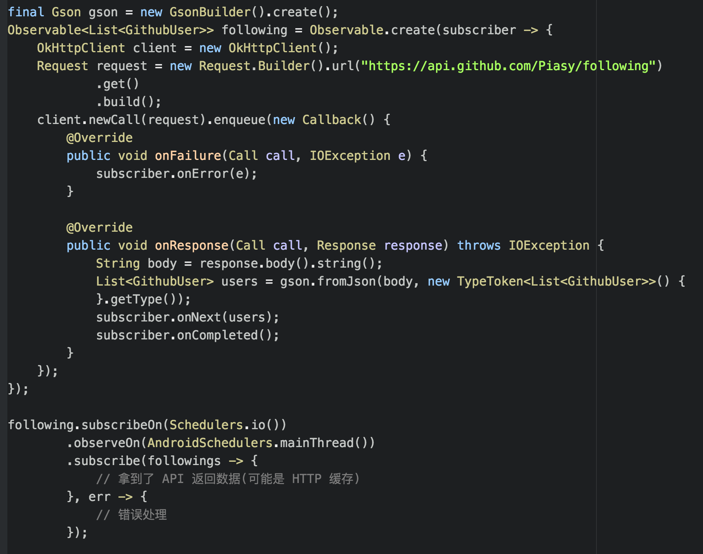

---

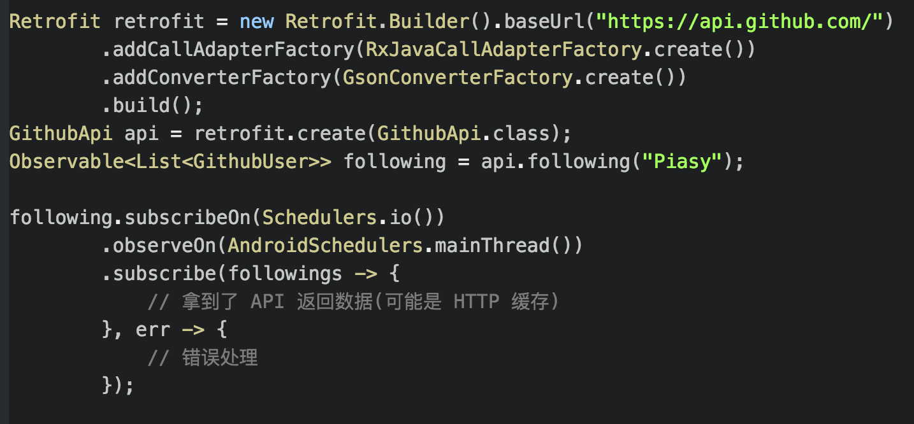

---

# Retrofit

+ 基于注解，减少 boilerplate code
+ 类型安全
+ 高度可扩展：converter，call adapter 随意配置
+ http://blog.piasy.com/2016/06/25/Understand-Retrofit/

---

# 需求：维护用户 following 列表

+ HTTP 缓存
+ 从服务器获取
+ _**SQLite 数据库本地缓存**_
+ 定义 Model 类型
+ 先展示本地缓存，再更新为网络数据
+ 多页面同步更新
+ Activity/Fragment 传参
+ 单元测试，集成测试

---

# SQLite 数据库本地缓存

+ 建表
+ 增删改查
+ transaction
+ io 线程执行

---

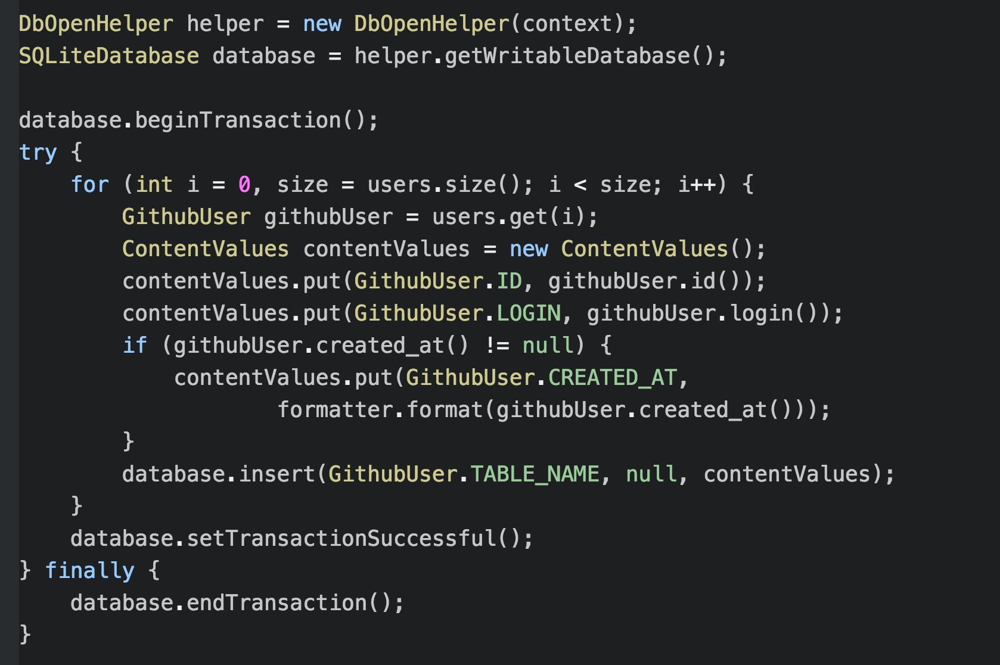

---

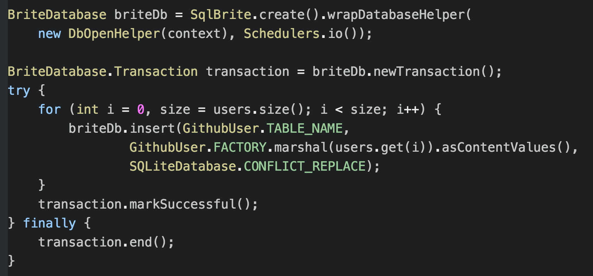

---

# SqlBrite

+ SQLiteOpenHelper 的轻量封装，提供更新提醒（RxJava Observable）
+ 基础 SQLite 访问 API
  + insert
  + delete
  + update
  + query
  + execute
  + transaction
+ 结合 SqlDelight，实现类型安全
+ https://github.com/square/sqlbrite

---

# 需求：维护用户 following 列表

+ HTTP 缓存
+ 从服务器获取
+ SQLite 数据库本地缓存
+ _**定义 Model 类型**_
+ 先展示本地缓存，再更新为网络数据
+ 多页面同步更新
+ Activity/Fragment 传参
+ 单元测试，集成测试

---

# 定义 Model 类型

+ immutable？
+ builder？
+ JSON 转换？
+ Server <=> Model <=> SQLite？

---

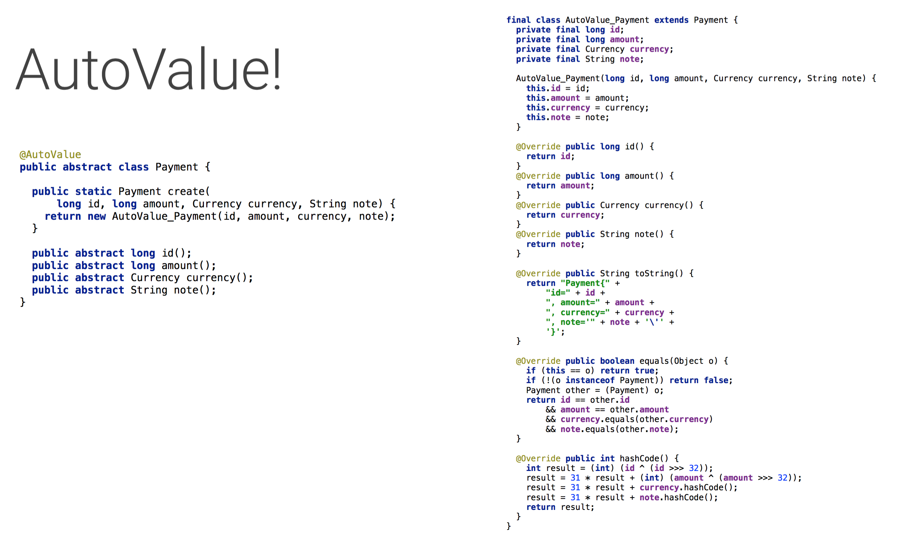

---

# JSON 转换

+ 使用 Gson
+ Gson 默认使用反射完成转换
+ 支持自定义转换逻辑
+ 通过测试，`toJson` 使用反射耗时增加：192.2% ~ 298%
+ http://blog.piasy.com/2016/05/06/Perfect-Android-Model-Layer/#autogson-

---

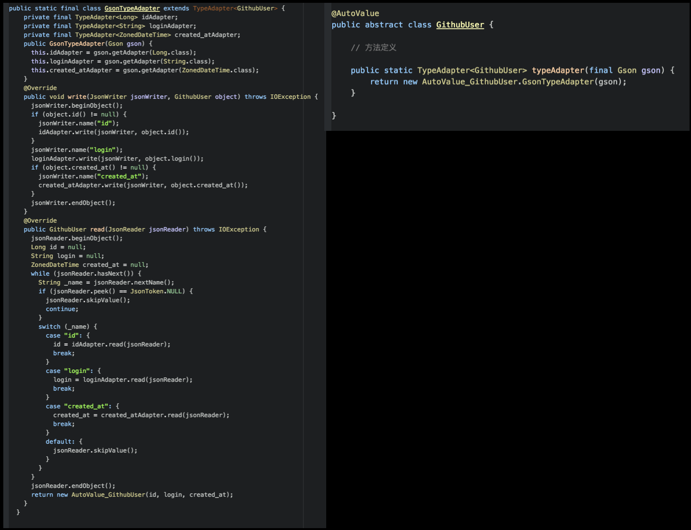

---

# AutoValue 及其扩展

+ apt 生成代码，稳定可靠
+ https://github.com/google/auto/blob/master/value/
+ 支持非反射 Gson：https://github.com/rharter/auto-value-gson
+ http://ryanharter.com/blog/2016/05/16/autovalue-extensions/

---

# Server <=> Model <=> SQLite

+ Server <=> Model：JSON，Gson，auto-value-gson
+ Model => SQLite：ContentValue
+ Model <= SQLite：Cursor

---

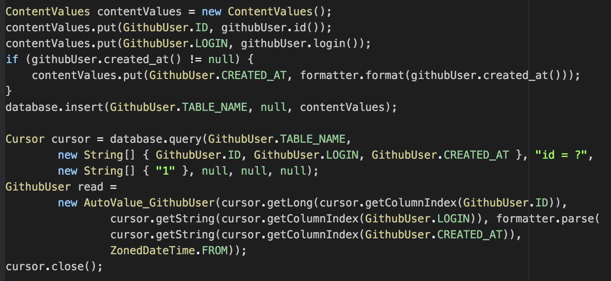

---

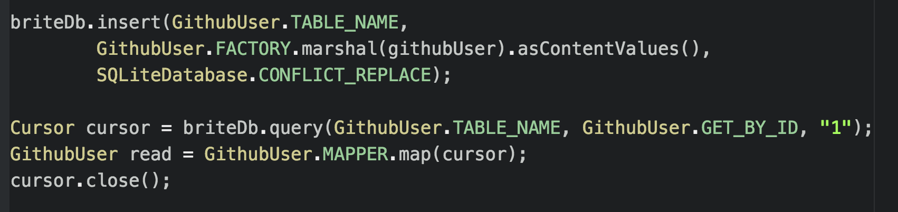

---

# SqlDelight

+ 根据建表 SQL 语句生成 model interface
+ 兼容 AutoValue
+ 生成 DB 读写类型安全转换代码
+ 支持自定义类型
+ https://github.com/square/sqldelight

---

# 需求：维护用户 following 列表

+ HTTP 缓存
+ 从服务器获取
+ SQLite 数据库本地缓存
+ 定义 Model 类型
+ _**先展示本地缓存，再更新为网络数据**_
+ 多页面同步更新
+ Activity/Fragment 传参
+ 单元测试，集成测试

---

# 先展示本地缓存，再更新为网络数据

+ 两个数据来源，如何结合？
+ 异步？
+ 错误处理？
+ 如果缓存命中，就不请求网络？

---

# RxJava

<!--
传统方案，两个流的发起、响应、异步等都需要单独处理
需要综合处理时又需要结合起来
-->

+ 强大的事件流处理能力：操作符
+ 简单的异步 API：`subscribeOn`，`observeOn`，`scheduler`
+ 集中错误处理
+ http://blog.csdn.net/theone10211024/article/details/50435325

---

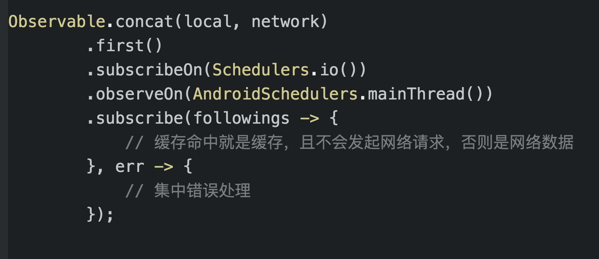

---

# 需求：维护用户 following 列表

+ HTTP 缓存
+ 从服务器获取
+ SQLite 数据库本地缓存
+ 定义 Model 类型
+ 先展示本地缓存，再更新为网络数据
+ _**多页面同步更新**_
+ Activity/Fragment 传参
+ 单元测试，集成测试

---

# 多页面同步更新

+ 本质：数据源更新，要通知所有感兴趣的使用者（Observer）
+ Java 内置的 Observer API
+ EventBus
+ RxJava Observable！（涉及 DB 时 SqlBrite 已有支持）

---

# 需求：维护用户 following 列表

+ HTTP 缓存
+ 从服务器获取
+ SQLite 数据库本地缓存
+ 定义 Model 类型
+ 先展示本地缓存，再更新为网络数据
+ 多页面同步更新
+ _**Activity/Fragment 传参**_
+ 单元测试，集成测试

---

# Activity/Fragment 传参

+ 构造函数？Activity 由 framework 利用反射构造！
+ setter？Activity/Fragment 可能会被系统销毁然后恢复！
+ Activity 设置在 `Intent` 中，`getIntent()` 读取
+ Fragment 利用 `setArguments()` 设置，`getArguments()` 读取
+ `Bundle`，`Parcelable`
+ auto-value-parcel：https://github.com/rharter/auto-value-parcel
+ IntentBuilder，FragmentArgs，AutoBundle
+ AutoBundle：https://github.com/yatatsu/AutoBundle

---

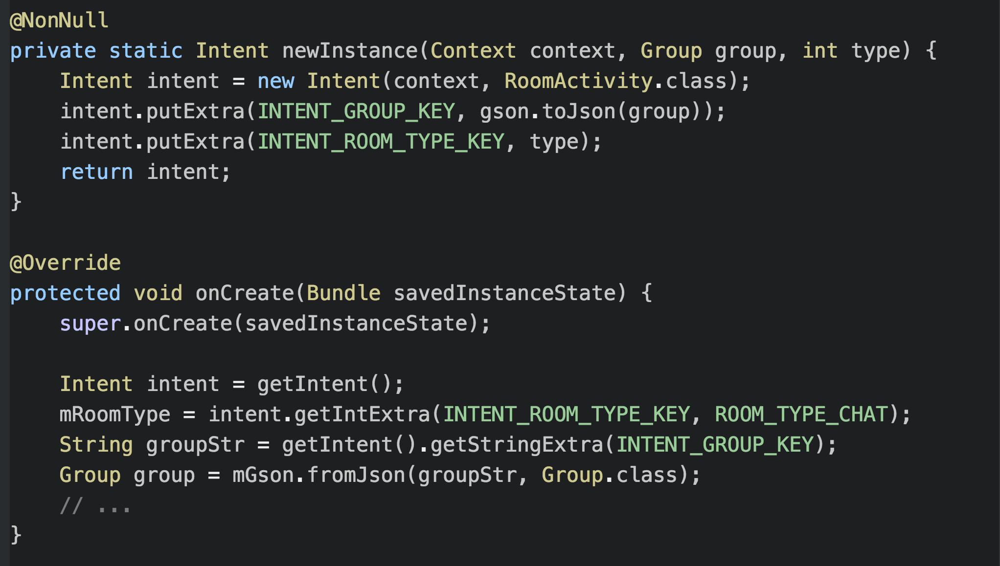

---

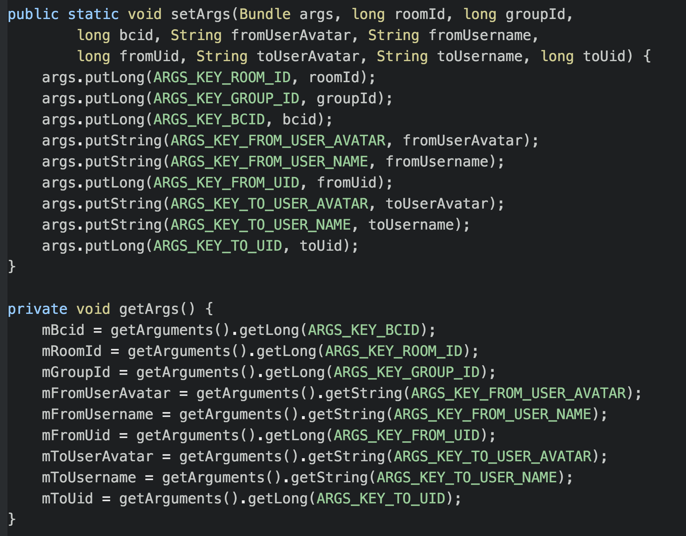

---

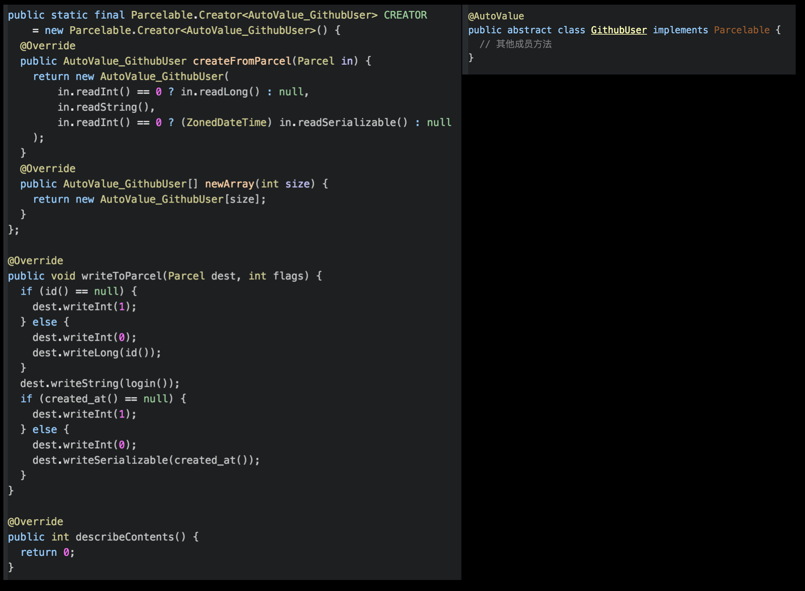

---

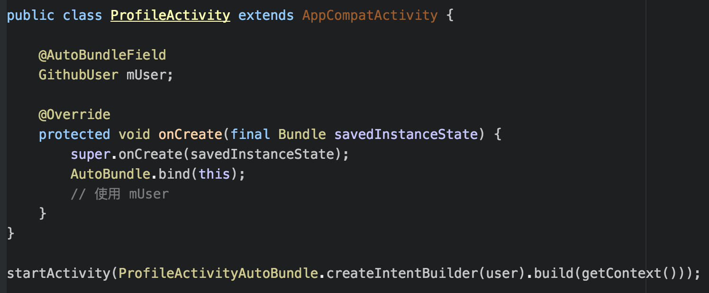

---

# 需求：维护用户 following 列表

+ HTTP 缓存
+ 从服务器获取
+ SQLite 数据库本地缓存
+ 定义 Model 类型
+ 先展示本地缓存，再更新为网络数据
+ 多页面同步更新
+ Activity/Fragment 传参
+ _**单元测试，集成测试**_

---

# 单元测试

+ 把对 framework 的依赖都通过 delegate 接口隔离，实现解耦
+ 接口可以随意 mock，JUnit 测试即可
+ 类似还有 MVP 模式中 V 引入接口
+ http://www.philosophicalhacker.com/2015/05/01/how-to-make-our-android-apps-unit-testable-pt-1/

---

# UnMock Plugin

单元测试：`*** not mocked`？

https://github.com/bjoernQ/unmock-plugin

---

# 集成测试

+ 测试中不要发起实际网络请求！
+ mock 哪一层？
+ 单元测试，mock 的越多越好
+ 集成测试，mock 的越少越好

---

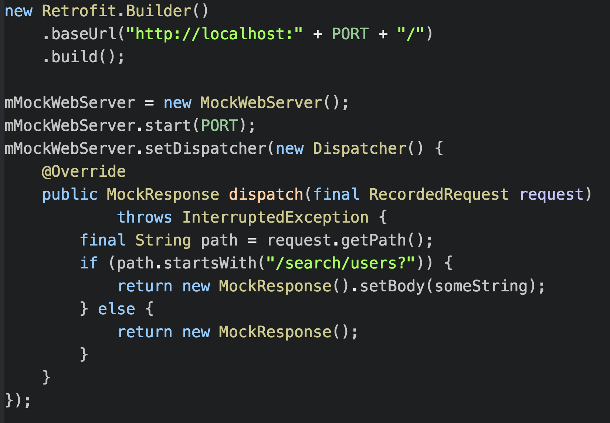

---

+ RequestMatcher
+ RequestsVerifier
+ https://github.com/andrzejchm/RESTMock

---

# Config Injection

+ 把业务相关的配置注入到业务无关的 model 架构中
+ Retrofit，EventBus，SqlBriteDatabase 等对象的创建都在 base module 中
+ debug，base url 等参数却和具体业务相关，甚至和 build 相关
+ 依赖倒置，base 不能依赖 model/app
+ injection! 类似有些框架中的配置文件

---

# ZonedDateTime

+ 用什么表示时间？
+ 获得指定日期时间的对象？获得加/减指定时间段之后的对象？计算两个时间的（日期）时间差？
+ `Date` + `Calendar`？`ZonedDateTime`！
+ Java 8 引入，解决老的 Date API 的问题
+ ThreeTenBP & ThreeTenABP
+ https://github.com/JakeWharton/ThreeTenABP

---

# Date API 的问题

+ mutable，非线程安全
+ 1 月的值是 0，转化为字符串时却显示 1
+ 没有和时区关联
+ 日期运算非常不方便
+ ...
+ http://stackoverflow.com/a/1969651/3077508

---

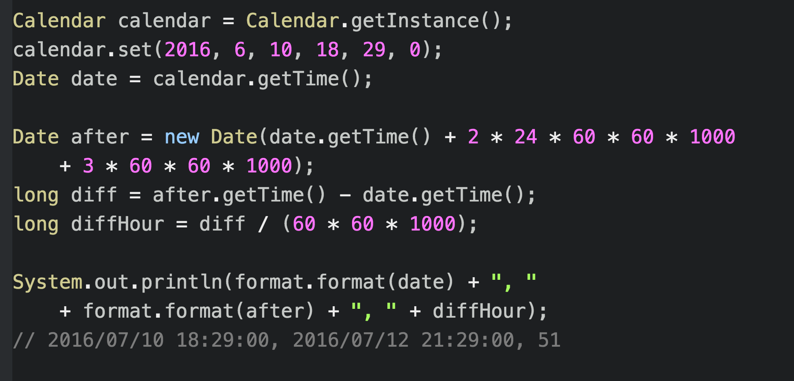

---

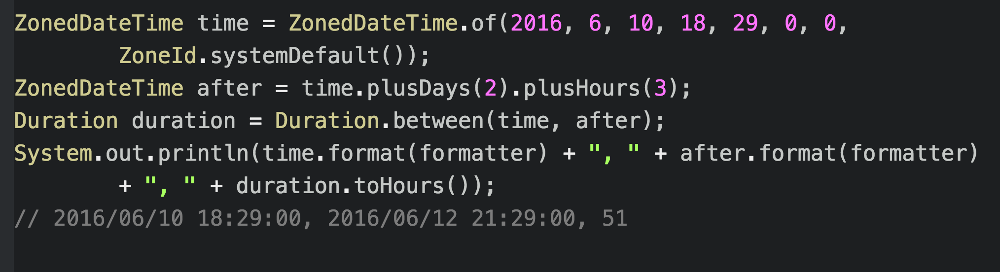

---

# 总结

+ OkHttp + Retrofit：调用 RESTful API
+ SqlBrite：数据库访问 && Rx
+ SqlDelight：SQL -> model interface，DB 安全读写
+ AutoValue(ext)：model interface -> model class
+ Gson，auto-value-gson：简洁高效 JSON 转换
+ RxJava：异步 && 事件流
+ delegate 接口层隔离安卓系统
+ Config injection
+ ZonedDateTime：安全，简单

---

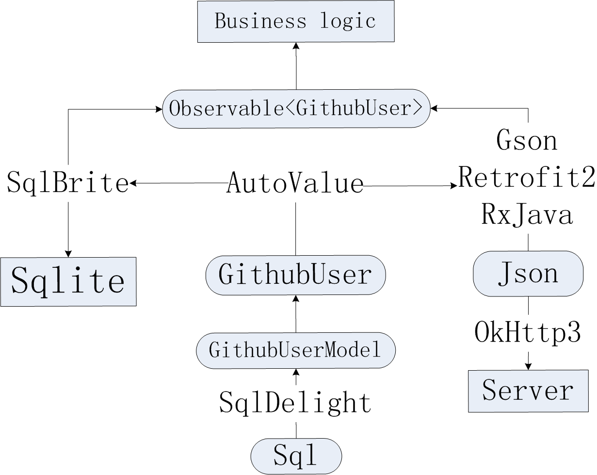

<!--
Immutable：auto-value (ext)
RESTful API：Retrofit
JSON 数据格式：Gson
Sqlite 数据库：SqlDelight, SqlBrite
Reactive：RxJava，SqlBrite
-->

---

# 不足

+ 东西较多，有一定复杂度，但我们想要的很多
+ 重度依赖 apt 代码生成

---

# 广告一则

+ YOLO：朋友间的视频直播 APP
+ 上线1年多，A轮融资
+ 招聘安卓、iOS、流媒体、PHP工程师
+ 简历发至 xujianlin@yoloyolo.tv

---

# 谢谢！

#### Q&A

